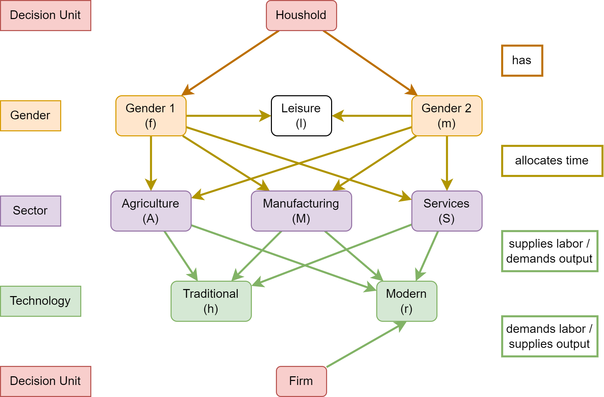

Gender Labor Biased Technological Change with Schooling
=======================================================

The [structural-schooling](https://github.com/pi-kappa-devel/structural-schooling) repository provides a collection of modular scripts used to calibrate an economic model of technological structural changes with households comprised of two individuals with distinct genders with endogenous schooling choices. The model is semi-analytically solvable and the optimization procedure for approximating its solutions is nested in the calibration procedure. 



The model is part of the work on gender schooling differences by [Karapanagiotis & Reimers (n.d.)](#ref-karapanagiotis2022). It combines the structural change elements of the model of [Ngai & Petrongolo (2017)](#ref-ngai2017), the educational choice elements of [Restuccia & Vandenbroucke (2014)](#ref-restuccia2014), and the seminal work of [Kongsamut, Rebelo, & Xie (2001)](#ref-kongsamut2001) on non-homothetic preferences. You may find the slides from an earlier presentation of the work at the workshop "Organizations, Markets, and Policy Interventions" [here](https://talks.pikappa.eu/ompi/). The calibration results of the paper can be obtained by executing the script [calibration.sh](src/calibration.sh) (Executing the script can take a lot of time to complete).

# Usage
The [calibration.py](src/calibration.py) script can be called from the shell of the command line. An expected call with all options set is of the form
```bash 
python calibration.py -s <calibration_setup> -g <income_group> -i <initializers_file> -p <parameter_file> -o <output_path> -r <results_path> -l <log_path> -a <adaptive_mode> -v <verbose>
```
where 

- `calibration_setup` is the (extendible) calibration setup (see sections [Out-the-box Calibration Functionality](#out-the-box-calibration-functionality) and [Extend the Calibration Functionality](#extend-the-calibration-functionality) for details),
- `income_group` is a country-income group enumeration with values [low, middle, high, all],
- `initializers_file` is a JSON file with initialing values for the calibrated free model parameters (default is [../data/initializers.json](data/initializers.json)),
- `parameters_file` is a JSON file with values for the fixed model and calibration targets (default is [../data/parameters.json](data/parameters.json),
- `output_path` is a system path where the output files are stored (default is ../out.[execution timestamp]),
- `results_path` is a system path where the tables and visualizations of the calibration results are stored (default is ../res.[execution timestamp]),
- `log_path` is a system path where the calibration log files are stored (default is ../log.[execution timestamp]),
- `adaptive_mode` is an option determining whether the nested optimization procedure uses as initializing values the calculated solution from the last calibration iteration (default is `True`), and
- `verbose` controls the verbosity level of the logger (default is `True`).

# Out-the-box Calibration Functionality
The following setups are already implemented in the sources of the repository.

- `abs-schooling`: Schooling years are targeted.
- `abs-schooling-no-modern-service-share-heterogeneity`: Schooling years are targeted. Equal modern services production shares for both genders.
- `abs-schooling-no-subsistence`: Schooling years are targeted. Preferences do not have a subsistence parameter.
- `abs-schooling-no-subsistence-no-wages`: Schooling years are targeted. Preferences do not have a subsistence parameter. The wage ratio is not targeted.
- `abs-schooling-no-subsistence-scl-wages`: Schooling years are targeted. Preferences do not have a subsistence parameter. The wage ratio error is weighted by $100$.
- `abs-schooling-no-wages`: Schooling years are targeted. The wage ratio is not targeted.
- `abs-schooling-scl-subsistence-scl-wages`: Schooling years are targeted. The consumption subsistence is weighted by $100$. The wage ratio error is weighted by $100$.
- `abs-schooling-scl-wages`: Schooling years are targeted. The wage ratio error is weighted by $100$.
- `abs-schooling-with-low-income-shares`: Schooling years are targeted. No variation of production shares across income.
- `no-schooling`: Schooling years are not targeted.
- `no-schooling-no-modern-service-share-heterogeneity`: Schooling years are not targeted. Equal modern services production shares for both genders.
- `no-schooling-no-subsistence`: Schooling years are not targeted. Preferences do not have a subsistence parameter.
- `no-schooling-no-subsistence-no-wages`: Schooling years are not targeted. Preferences do not have a subsistence parameter. The wage ratio is not targeted.
- `no-schooling-no-subsistence-scl-wages`: Schooling years are not targeted. Preferences do not have a subsistence parameter. The wage ratio error is weighted by $100$.
- `no-schooling-no-wages`: Schooling years are not targeted. The wage ratio is not targeted.
- `no-schooling-scl-subsistence-scl-wages`: Schooling years are not targeted. The consumption subsistence is weighted by $100$. The wage ratio error is weighted by $100$.
- `no-schooling-scl-wages`: Schooling years are not targeted. The wage ratio error is weighted by $100$.
- `no-schooling-with-low-income-shares`: Schooling years are not targeted. No variation of production shares across income.
- `rel-schooling`: Share of schooling life is targeted.
- `rel-schooling-no-modern-service-share-heterogeneity`: Share of schooling life is targeted. Equal modern services production shares for both genders.
- `rel-schooling-no-subsistence`: Share of schooling life is targeted. Preferences do not have a subsistence parameter.
- `rel-schooling-no-subsistence-no-wages`: Share of schooling life is targeted. Preferences do not have a subsistence parameter. The wage ratio is not targeted.
- `rel-schooling-no-subsistence-scl-wages`: Share of schooling life is targeted. Preferences do not have a subsistence parameter. The wage ratio error is weighted by $100$.
- `rel-schooling-no-wages`: Share of schooling life is targeted. The wage ratio is not targeted.
- `rel-schooling-scl-subsistence-scl-wages`: Share of schooling life is targeted. The consumption subsistence is weighted by $100$. The wage ratio error is weighted by $100$.
- `rel-schooling-scl-wages`: Share of schooling life is targeted. The wage ratio error is weighted by $100$.
- `rel-schooling-with-low-income-shares`: Share of schooling life is targeted. No variation of production shares across income.

# Extend the Calibration Functionality

The calibration procedure can be easily extended to use different targets and weights. One can modify the `setups` function in [calibration_traits.py](src/calibration_traits.py) and add a custom calibration setup by inserting a key-callback pair at the dictionary the function returns. The callback is called after the default initialization of the calibration data structure. Examples of how to write a callback can be found in the same file. All functions of [calibration_traits.py](src/calibration_traits.py) using a `_prepare_` prefix in their names are the callbacks used by the out-of-the-box calibration setups.

# Design
The calibration code is written using the functional paradigm to minimize the possibility of side effects from the mathematical complications. The implemented functions follow the derived equations for the semi-analytic equilibrium solutions of the model. The implemented expressions can be found in the online appendix of [Karapanagiotis & Reimers (n.d.)](#ref-karapanagiotis2022).

# Dependencies

The nested calibration procedure is implemented in Python (originally with version 3.8.10). We use NumPy (version 1.22.3) for vector calculations. For the inner optimization procedure, we implement a customized version of gradient descent with adaptive step size and additional validity checks based on the model's economic properties. For the outer minimization problem, we use the Nelder-Mead implementation of SciPy (version 1.3.3). The minimization routine can be modified by setting the `["calibrator"]["method"]` value of the calibration data dictionary created by `calibration.make_calibration_data`.

# Contributors

[Pantelis Karapanagiotis](https://www.pikappa.eu)

[Paul Reimers](https://www.wiwi.uni-frankfurt.de/profs/fuchs/reimers.php)

Feel free to share and distribute. If you would like to contribute, please send a pull request.

# License

The code is distributed under the Expat [License](LICENSE).

# References

<div id="refs" class="references">

<div id="ref-karapanagiotis2022">
Pantelis Karapanagiotis and Paul Reimers. Why does the Schooling Gap Close while the Wage Gap Persists Across Country Income Comparisons? Working Paper. doi: <https://dx.doi.org/10.2139/ssrn.3691055>.
</div>

<div id="ref-kongsamut2001">
Piyabha Kongsamut, Sergio Rebelo, and Danyang Xie. Beyond balanced growth. The Review of Economic Studies, 68(4):869–882, 2001. doi: <https://doi.org/10.1111/1467-937X.00193>.
</div>

<div id="ref-ngai2017">
L. Rachel Ngai and Barbara Petrongolo. Gender gaps and the rise of the service economy. American Economic Journal: Macroeconomics, 9(4):1–44, October 2017. doi: <https://doi.org/10.1257/mac.20150253>.
</div>

<div id="ref-restuccia2014">
Diego Restuccia and Guillaume Vandenbroucke. Explaining educational attainment across countries and over time. Review of Economic Dynamics, 17(4):824–841, 2014. doi: 10.<https://doi.org/10.1016/j.red.2014.03.002>.
</div>

</div>
